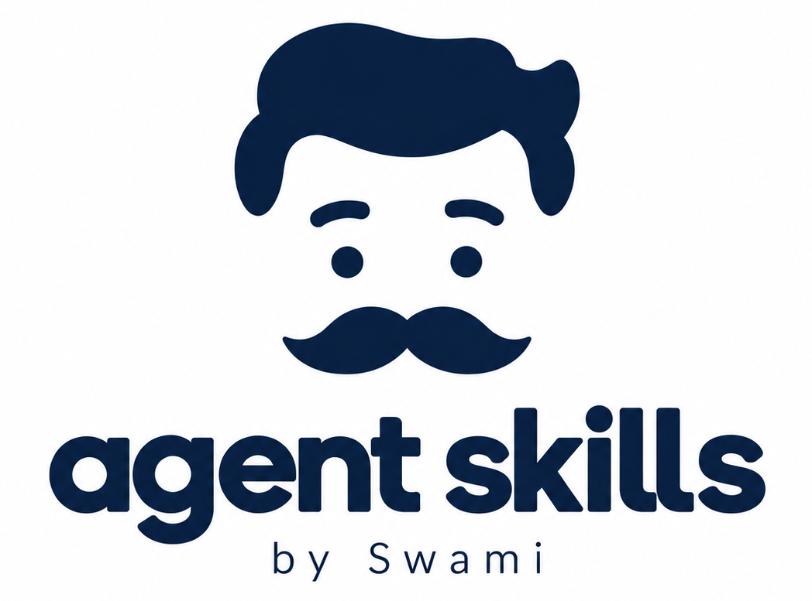

# Agent Skills, the Swami Way

A growing collection of agent skills I build, refine, and use.

Each skill is a self-contained capability designed to be understood by agents, executed in real workflows, tested for quality, and explicit about its boundaries.

<p align="center">

</p>

## Anatomy of a Skill

```text
skill-name/
├── SKILL.md
├── references/
├── assets/
├── scripts/
├── evals/
└── trust/
```

A skill can bring together six concerns:

|               | Purpose                                               |
| ------------- | ----------------------------------------------------- |
| `SKILL.md`    | **Instructions** — what the agent should do           |
| `references/` | **Knowledge** — what the agent should know            |
| `assets/`     | **Resources** — what the agent has to work with       |
| `scripts/`    | **Execution** — deterministic tools the agent can run |
| `evals/`      | **Quality** — tests that prove the skill works        |
| `trust/`      | **Boundaries** — guardrails and constraints           |

Not every skill needs every directory. `SKILL.md` is the entry point; everything else exists to make the capability more useful, reliable, and trustworthy.

## Installation

Installation depends on the agent or harness.

```bash
git clone <repo-url>
```

Install the entire collection or expose individual skill directories using your agent's supported skill-discovery mechanism.

## Growing the Collection 

This repository is intentionally a living system. Skills will evolve as workflows improve, domain knowledge changes, better evaluations are developed, and new capabilities emerge. The goal isn't to accumulate prompts.
