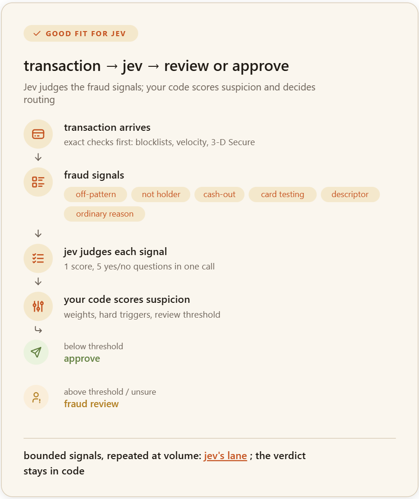

# is-it-for-jev

Agent Skill that tells you whether an idea belongs to [Jev](https://docs.typesafe.ai), TypeSafe's System 1 decision model, a regular LLM call, plain code, or a person, and hands you a working implementation when it fits.

<p align="center">

</p>

## What it does

Describe an idea in a sentence or two. The skill sorts it into one bucket:

| Bucket | When |
|---|---|
| **Code** | The logic is exact: a threshold, a lookup, arithmetic. |
| **Jev** | A fixed set of answers, but choosing takes judgment rules can't make. |
| **LLM** | It needs generation. Jev can pick "O" from A to Z; it can't write "Hello." |
| **Person** | Irreversible, or too high-stakes for any model. |

You get a verdict, Good fit, Partial fit, or Not a fit, with the specific reason, not a template explanation.

## What you get, when it fits

- **A request body** (`state` and `questions`) checked against Jev's schema, ready to send.
- **The gating code**, kept separate: the threshold, what happens on each side of it, and the fallback if the call fails.
- **A verdict diagram** as SVG, Mermaid, or Markdown, whichever the host renders.

## Try it

```
Good fit
  Screen a checkout order for signs of fraud before fulfillment.
  Decide which shipping tier a warehouse should route a package to.

Partial fit
  Auto-delete accounts that look like bots.
  Score a blog draft's quality before it's published.

Not a fit
  Write a product description from a feature list.
  Summarize a contract's key risks.
```

## In this repo

| Path | What |
|---|---|
| `SKILL.md` | The skill itself. |
| `references/` | The Jev API contract, the decision pipeline, the verdict card spec. |
| `assets/` | JSON Schemas, example requests, icons (Tabler, MIT, see `ICONS-LICENSE.txt`). |
| `scripts/` | Request validator, gating template, verdict card renderer. No dependencies. |
| `evals/` | 19 test scenarios. |
| `trust/` | Guardrails for credentials and live API use. |

Full detail lives in `SKILL.md` and `references/`; this file is just the front door.
