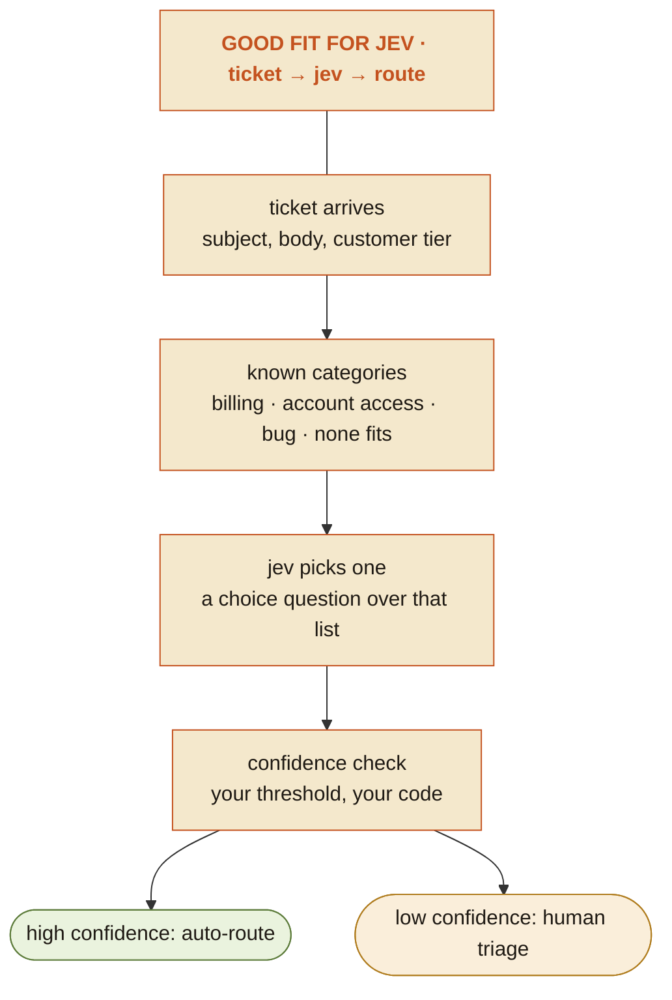

# is-it-for-jev

Author: Swami Chandrasekaran

Suggested slug in the ROAD dot-notation convention (not a registered entry): `Evaluator.AI.DecisionArchitecture.AssessJevFit.v1`

This skill decides whether a piece of work belongs to Jev, and when it does, hands back a request that can be sent as-is. It does not write prose for the user's product; it classifies, drafts the typed request, and draws the verdict.

## Package map

| Path | Read or run it when |
|---|---|
| `references/jev-api.md` | Before writing any request. The API contract, the MCP route, question-writing rules, and how to read answers. |
| `references/decision-pipeline.md` | Designing the code around a Jev call; a full worked example. |
| `references/visual-style.md` | Before producing the verdict card. Delivery tiers, spec format, tones, palette. |
| `trust/guardrails.md` | Before touching a real environment, credentials, or the live API. |
| `assets/jev-request.schema.json`, `assets/jev-response.schema.json` | The contract as JSON Schema. |
| `assets/examples/` | Complete valid requests to adapt, and one MCP `evaluate` call. |
| `scripts/validate_request.py` | After drafting a request. No dependencies. |
| `scripts/confidence_gate.py` | Template for the caller's gating code; handles all three answer types. |
| `scripts/render_verdict.py` | To produce the verdict card as SVG, Mermaid, and Markdown. |

---

## 1. What Jev is

Jev takes a `state` (text or JSON) and a map of typed questions, and answers every question in one pass with probabilities. It cannot write text, code, summaries, or explanations. It returns only values the caller defined, so schema errors are impossible; wrong answers are not. Those are separate problems, and the second one is why a threshold and a fallback always sit around it.

**The HELLO Test.** Given options `A` through `Z` and the input `H-E-L-L`, Jev can pick `O`. It cannot write the word "Hello." Any step that needs new language, code, or free-form output fails the test and belongs to a generative model.

**Also poor fits:** arithmetic, counting, and date reasoning (compute in code, pass the result in state), and images or audio, since Jev takes only text or JSON as state.

**Three question types:**

| Type | Answers | Returns | Gate on |
|---|---|---|---|
| **Noul** | yes or no | `noul`, probability of yes | the `noul` value itself (there is no confidence field) |
| **Choice** | one option from 2 to 255 you define | `choice`, `probabilities`, `confidence` | `confidence` |
| **Score** | a position on 2 to 10 ordered levels | `score` (can fall between levels), `legend`, `probabilities`, `confidence` | `confidence` |

**Published figures are vendor claims.** $0.042 per million input tokens with output unmetered, a 32K context, and TypeSafe's "up to 193.6x faster, 444.6x cheaper than LLMs" from its own evaluations. Quote them as TypeSafe's numbers, never as measured results, and never size a build on them without the user's own shadow-mode data.

Knowing what Jev is only matters once it's placed inside something bigger than itself.

## 2. Where Jev sits

Every decision point in a pipeline runs **input → judgment → decision → action**. Jev is only ever the judgment, never the other three.

- **Exact distinctions** (lookups, thresholds, arithmetic, permissions) go to code.
- **Semantic distinctions** (intent, tone, risk, relevance, ambiguity) go to Jev.
- **The decision rule** (thresholds, policy, what happens on each side) stays in the caller's code.
- **The action** (calling a tool, sending, merging) stays in the caller's code, and is logged with the request and answer.

When outcomes disagree with decisions, find out why (missing variable, wrong split between exact and semantic, miscalibrated answer, misplaced threshold) before changing anything. `references/decision-pipeline.md` walks one example end to end.

That's the theory. In practice, almost every request to this skill is one question: does a specific idea belong in the judgment slot or not.

---

## 3. Quick verdict (the default)

Most inputs are a sentence or a rough idea, not an audit request. Answer directly, in this order:

1. **Verdict**: Good fit, Partial fit, or Not a fit.
2. **Why**: two to four sentences naming the property that makes or breaks it ("the categories aren't fixed yet", "this is generated prose, so it fails the HELLO Test"). Not a restatement of the checklist.
3. **Partial fit only**: the specific changes that would make it a good fit. What must become enumerable, what state must exist, what must become reversible, what escalation path must be defined.
4. **Not a fit only**: what it should be instead: a generative model, plain code, or a person. If one sub-step is genuinely bounded, name it as an optional aside, but don't invent one to soften the verdict.
5. **Good or partial fit**: the request body and the gating rule (section 4).
6. **The verdict card** (section 5).

Skip the audit phases unless the user asks for an audit or wants to go deeper after the verdict.

### What makes a good fit

All of these, not most:
- a finite answer space
- a semantic judgment that rules can't make reliably
- repeated or latency-sensitive execution
- enough context in the state for one bounded decision
- a reversible action, or a clear escalation path
- measurable success

Common shapes: picking a tool or agent, routing to a model or reasoning level, continue or stop, complexity triage, approve or block, ranking candidates, admitting to memory, detecting injection or sensitive content, deciding review depth, deciding whether a person must confirm.

### Classification

- **A: Code.** The distinction is exact. No Jev.
- **B: Jev.** Bounded semantic judgment.
- **C: Generative model.** Needs text, code, or open-ended reasoning.
- **D: Person.** Irreversible, high-stakes, or no way to measure success.

### Ambiguous input

An underspecified idea is not a reason to stop. Fill gaps with a stated assumption ("assuming the category list is fixed") and give the verdict against it. Two exceptions:

- **Nothing to evaluate yet** ("add some AI to checkout"). Say there is no concrete decision yet, name what would make it one (what is being decided, from what), and stop. Don't grade an invented scenario, and don't show a verdict badge.
- **One unstated fact flips the verdict** ("help us pick a vendor": good fit against a fixed shortlist, not a fit for open-ended sourcing). Ask that one question.

A verdict of Good fit or Partial fit is a promise: the next thing the user sees is a request they could actually send.

---

## 4. The Jev request (good and partial fits)

Read `references/jev-api.md` first, in full; it covers not just the field shapes below but how to write a question worth asking (one snap judgment per question, when to split a judgment into several weighted ones, why to batch every question the input might need into one request, and the real Noul-versus-Score trap). Getting the shape right and getting the question right are different skills, and this skill is judged on both. Then give the user a complete body for `POST https://api.typesafe.ai/v1/systemone` that they can send unchanged:

```json
{
  "state": { "subject": "...", "body": "...", "customer_tier": "pro" },
  "model": "jev-1.13.0",
  "questions": {
    "team": {
      "type": "choice",
      "instructions": "Which team should handle the ticket in `subject` and `body`?",
      "criteria": {
        "billing": "Charges, invoices, refunds",
        "account_access": "Login, passwords, SSO",
        "none_fits": "None of the teams above clearly fits"
      }
    }
  }
}
```

Rules:
- **Ask about evidence, never the verdict.** Options that name an action or disposition (approve, review, block, legitimate, suspicious, fraud) mean Jev is being asked to make the decision. Split it into the facts a person would weigh, one question each, and combine them in the gating code. Don't add a Score that rates the same verdict on a scale.
- Exactly three top-level fields: `state`, `model`, `questions`. Nothing else.
- Pin the model version in anything meant for production; mention that `jev-latest` can move.
- Question ids are not sent to the model. Instructions must stand alone and name state fields in backticks.
- A Choice includes a "none fits" option whenever that outcome is possible.
- Put only decision-relevant fields in `state`. Leave out names, addresses, card digits, and ids the judgment doesn't need. Compute numbers in code first and pass the number, not a conclusion like "unusually high." Exact checks (CVV, 3-D Secure, blocklists) run in code before the call and stay out of the state.
- Several questions about the same state go in one request.
- For a partial fit, draft the request as it would look once the gap is closed, and mark what is still missing.
- If the host can run code, save the body and run `python scripts/validate_request.py body.json`; fix every error before showing it. Otherwise check it by hand against `assets/jev-request.schema.json`.

Then show the gating rule as separate code, following `scripts/confidence_gate.py`: which threshold, what happens above it, what happens below it, and the fallback when the call fails. Label every threshold as a starting value to tune in shadow mode.

The request and the gate are the substance. The card that follows is how the verdict gets read at a glance, not a decoration to skip.

---

## 5. The verdict card

Every verdict gets a card, and it must render on whatever host is running this skill. Follow `references/visual-style.md`:

1. If Python runs: write the spec, run `python scripts/render_verdict.py spec.json --out verdict`, and share `verdict.svg` the way the host shares files. The script's `.mmd` output is already safe Mermaid.
2. If Python can't run, but Markdown renders Mermaid: write the Mermaid by hand, following the rules and template below exactly.
3. Otherwise: the Markdown text card.

Never drop the visual silently. The ambiguous "nothing to evaluate yet" case gets no card.

### Hand-written Mermaid: rules

Each rule below prevents a parse error that has actually happened:
- Attach a class with `:::` and **no spaces**: `s1["..."]:::accent`. Writing `s1["..."] ::: accent` breaks the whole diagram.
- **Quote every label**: `s1["label"]`. Unquoted parentheses, colons, or slashes break parsing.
- Inside a label, write a double quote as `#quot;` and a line break as `<br/>`. No other HTML, and no emoji.
- Use only the class names from the template. Never name a class `default`; Mermaid reserves it.
- One statement per line. Put the verdict in the first node rather than a `title:` header, which older renderers reject.

Template for a good fit (it parses on Mermaid 10 and 11):



Adapting it:
- **Partial fit:** badge text `PARTIAL FIT FOR JEV`, `classDef badge` recolored to `fill:#faeeda,stroke:#b07d1f,color:#b07d1f`, and the missing piece as a `:::hold` step.
- **Not a fit:** badge text `NOT A FIT FOR JEV`, `classDef badge` recolored to `fill:#e9e6df,stroke:#5f5e5a,color:#5f5e5a`, every step `:::gray`, and no branch nodes.
- **An optional bounded sub-step inside a not-a-fit task:** add `c1["OPTIONAL: needs senior review? a yes/no jev could gate"]:::callout`, linked to the step it belongs to with a dotted line, for example `s2 -.- c1`.

Keep every `classDef` line even if some classes go unused.

Everything above handles one idea at a time. The next section is the same judgment, run in a loop across an entire codebase.

---

## 6. Full audit (only when asked)

**Phase 1: Read-only inventory.** Inspect configuration and workflow files: `~/.codex/config.toml`, `~/.claude/settings.json`, configured MCP servers, installed skills, plugins, and rules, `AGENTS.md` and `CLAUDE.md`, hooks, commands, routing config, and non-sensitive usage metadata. Report paths that couldn't be read. Modify nothing. Follow `trust/guardrails.md`.

**Phase 2: Find decision points.** Look for places where a full generative call is used to make a bounded decision. Classify each A, B, C, or D.

**Phase 3: Rank.** Up to 10 candidates in a table: decision; where it happens today; why code isn't enough; why Jev fits; state Jev would receive; question type; possible answers; starting thresholds; action above threshold; action below; risk and reversibility; expected savings (labeled as estimates, never invented usage numbers); implementation difficulty.

**Phase 4: Design the top three.** For each: the full request body (validated), an example state, the gating code, where it connects to the orchestrator, what stays deterministic, and how to verify and roll back.

**Phase 5: Recommend one.** Highest call frequency, lowest risk, clearest measurable payoff, easiest rollback, least sensitive data. Install nothing. Show the audit and ask which to build.

**Phase 6: Build after approval.** Wire Jev in as a decision tool for the clients the user chose: the `evaluate` MCP server for agent hosts (see `references/jev-api.md`), or an SDK or HTTP call in application code. Access is direct through TypeSafe (waitlisted) or through a gateway such as OpenRouter or Vercel AI Gateway; confirm the current model id on the provider's page. Run one reversible dry run in shadow mode before anything acts on answers.

---

## Final rule

Jev decides where the judgment goes. Code still owns the thresholds, the actions, and the consequences, whether the question came from a one-line idea or phase four of a full audit. Every verdict, request, and gate this skill produces should make that split visible, not paper over it.
